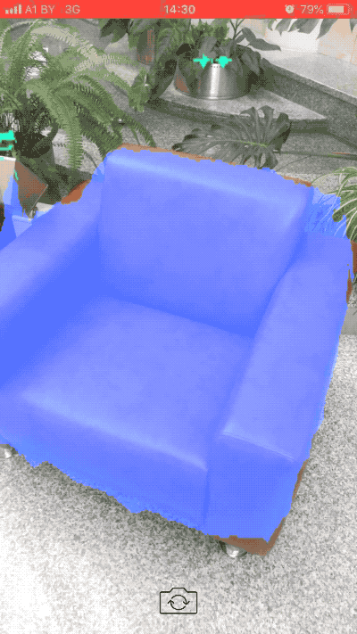

<h1 align="center">

</h1>

[MakeML](https://makeml.app?utm_source=github.com&utm_medium=semantic_segmentation&utm_campaign=readme_file) is a Developer Tool for Creating Object Detection and Segmentation Neural Networks without a Line of Code. It's built to make the training process easy to setup. It is designed to handle data sets, training configurations, markup and training processes — all in one place.

## Semantic Segmentation iOS
Is an iOS app example that uses Tensorflow Lite on GPU. Used [DeepLab](https://ai.googleblog.com/2018/03/semantic-image-segmentation-with.html) .tflite [model](https://storage.googleapis.com/download.tensorflow.org/models/tflite/gpu/deeplabv3_257_mv_gpu.tflite).  
<div align="center">

</div>

## Train Objects Segmentation .tflite model
[](https://makeml.app)

See the [Tutorial](https://makeml.app/docs/nails_tutorial_intro?utm_source=github.com&utm_medium=semantic_segmentation&utm_campaign=readme_file) for the training object segmentation model without a line of code with macOS desktop application.

<div align="center">

</div>

## Using another .tflite model in iOS application
[](https://makeml.app)    [](https://makeml.app)

For using this project with another .tflite file, add it to the project and change this line with your name of the model.
```
NSString *modelPath = FilePathForResourceName(@"deeplabv3_257_mv_gpu", @"tflite");
```

Change the number of classes and add colors to the array:
```
int class_count = 21;
unsigned int colors[21] = { ... };
```

## Links

[More Tutorials](https://makeml.app/tutorials?utm_source=github.com&utm_medium=semantic_segmentation&utm_campaign=readme_file) | [MakeML in App Store](https://apps.apple.com/us/app/makeml/id1469520792?mt=12) | [Full Documentation](https://makeml.app/docs/doc1?utm_source=github.com&utm_medium=semantic_segmentation&utm_campaign=readme_file) | [MakeML Chat](https://discordapp.com/invite/vgcG3Su) | [Support page](https://makeml.app/support?utm_source=github.com&utm_medium=semantic_segmentation&utm_campaign=readme_file)
